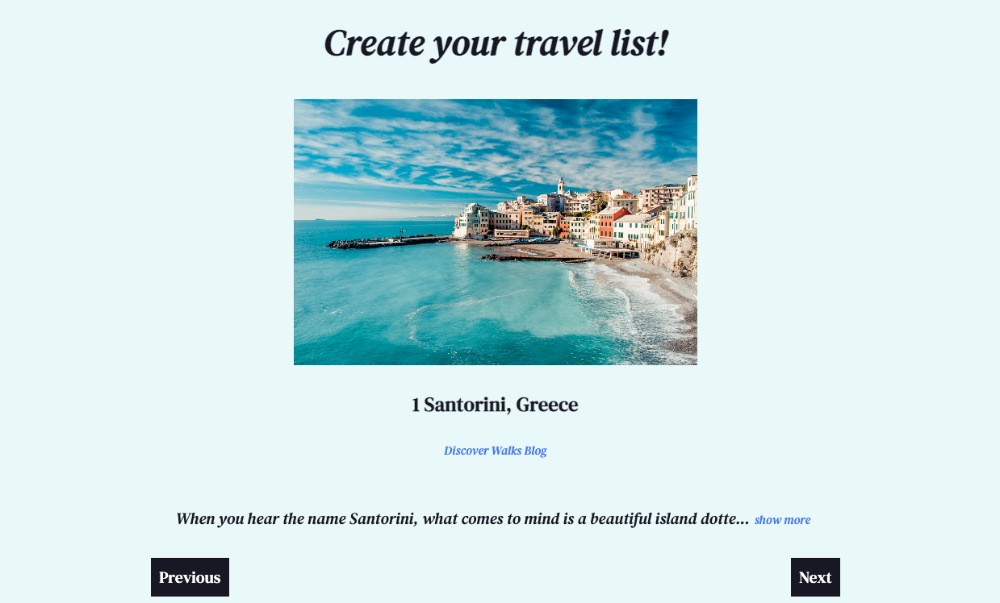
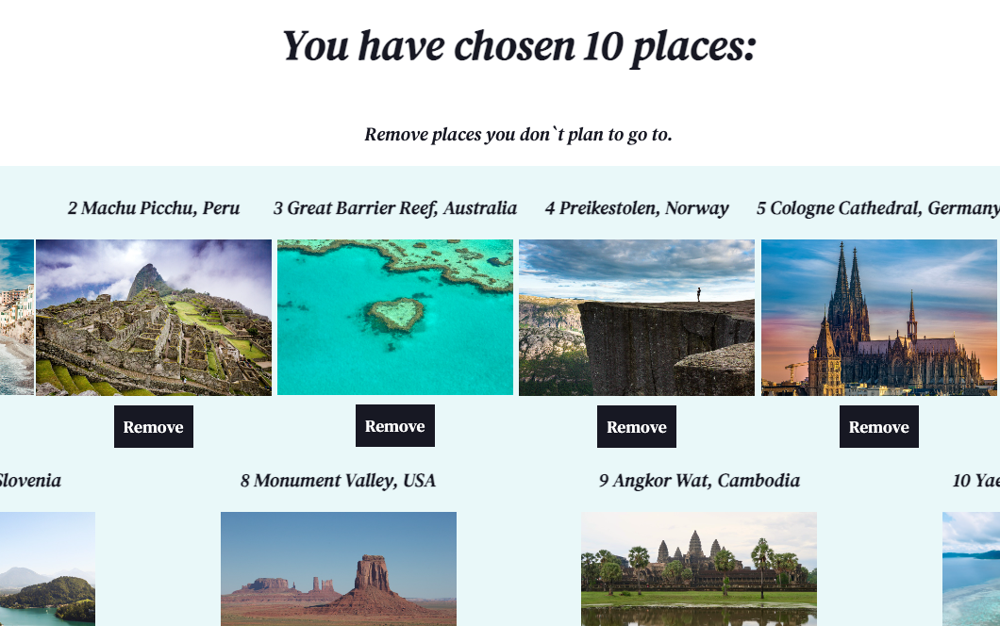

# Travel Planner App

## Description

The Travel Planner App is designed to help users explore and organize their dream destinations. Featuring a carousel of beautiful and inspiring locations and a customizable list of must-visit places, this app is the perfect tool for planning your next adventure.

## 

## Features

### Carousel Viewer:
Browse through a collection of stunning images and descriptions of various destinations. Users can learn more about each place and see additional details by clicking the "show more" button.
### Carousel Viewer

### Must-Visit List:
This section allows users to manage a list of their selected destinations. Places can be removed from the list if the user decides they are no longer interested, providing a personalized planning experience.
### Must-Visit Viewer

## Components

### Carousel:
Allows users to navigate through different places with options to see the previous or next place. Each place displays an image, a short description that can be expanded, and source information.

### MustVisit:
Displays a list of places the user is interested in visiting. Each list item includes options to remove the place from the list, aiding in refining the travel plan.

## How to Use

### Navigating the Carousel:

1. Click "Previous" or "Next" to view different locations.
2. Expand the description of each location by clicking "show more" or hide it with "show less".

### Managing the Must-Visit List:

1. Review the places you have chosen.
2. Click "Remove" on any place you decide not to visit to keep your list focused and up-to-date.

## Installation

To get started with the Travel Planner App, clone this repository and run the following commands: 
npm install
npm start

This will install all required dependencies and start the app in your default web browser.

## Technologies Used

React.js
CSS
HTML

## License

This project is licensed under the MIT License.

